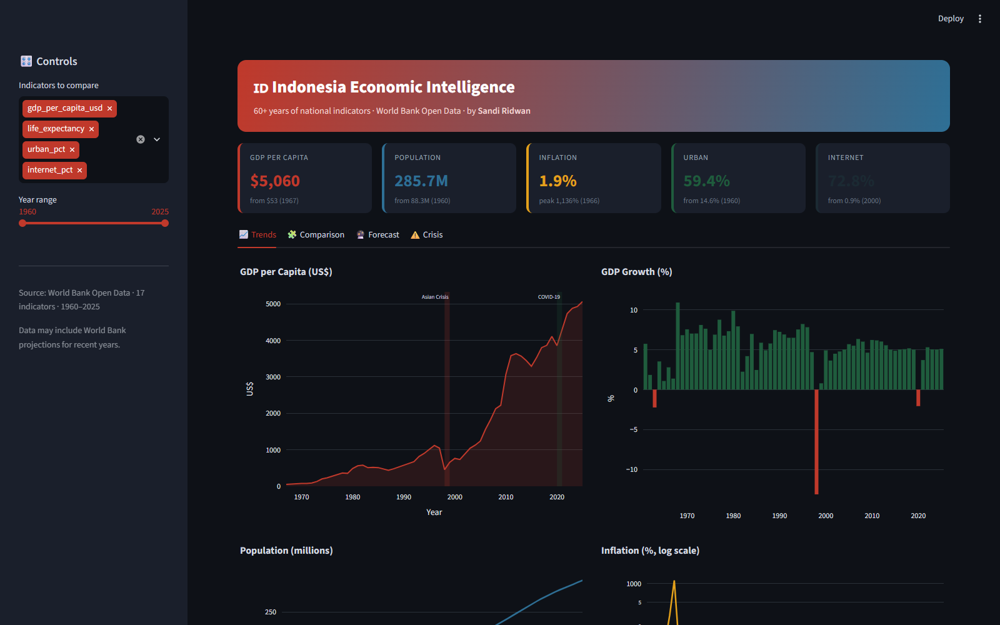
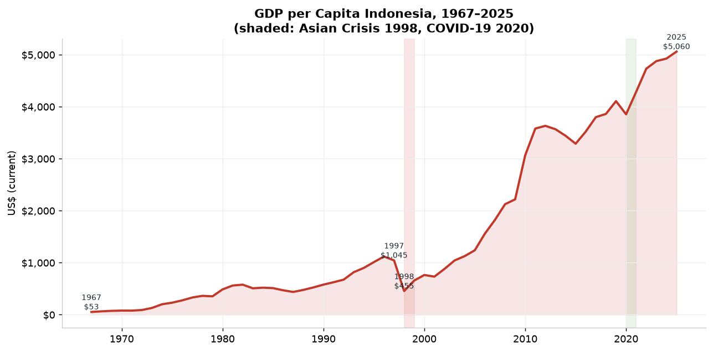
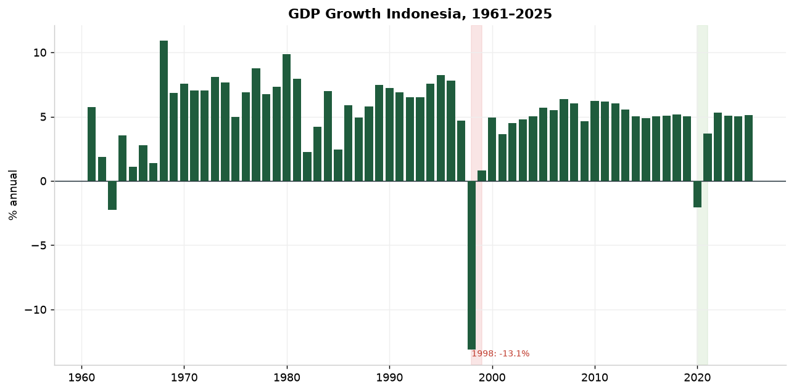
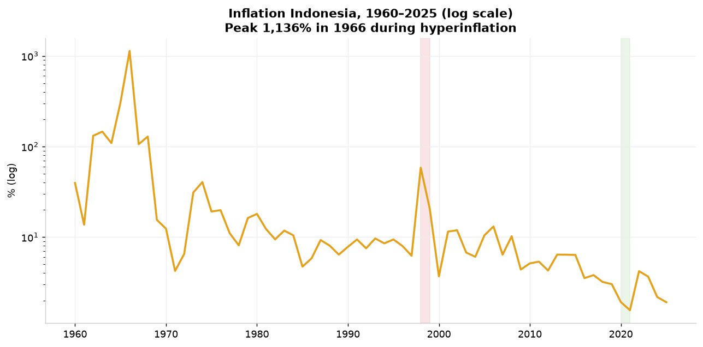
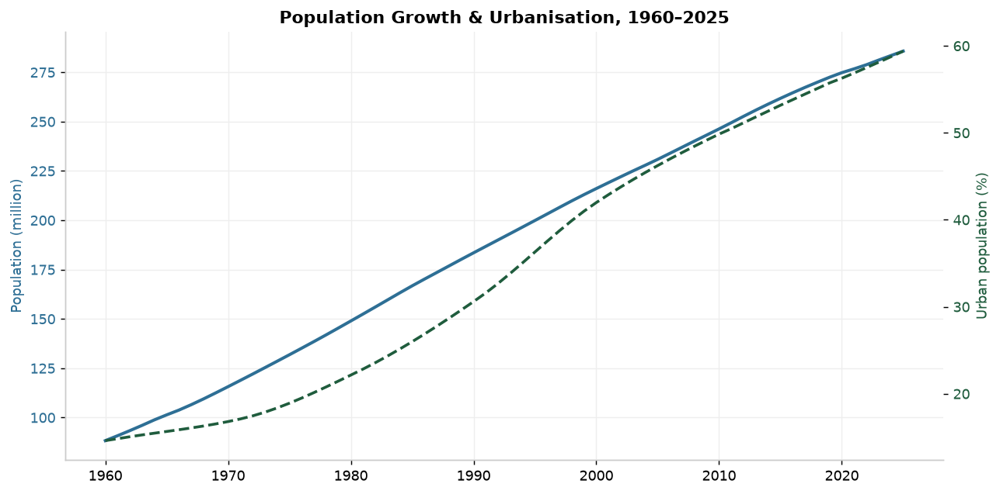
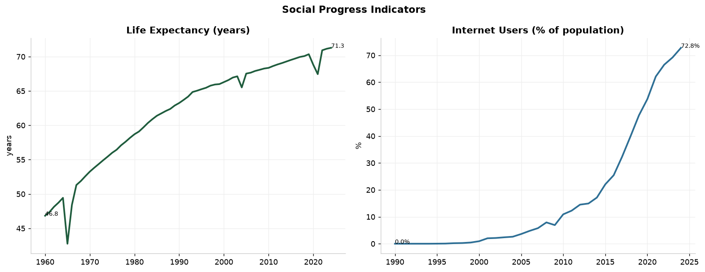
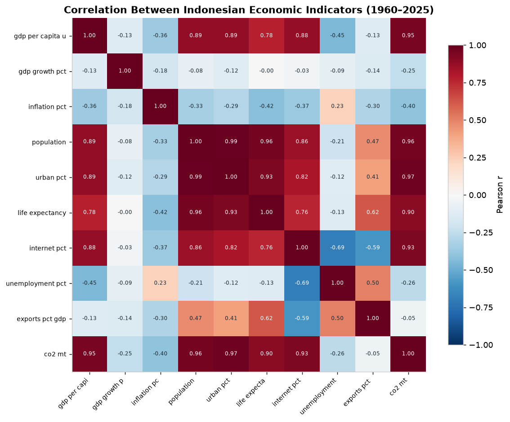
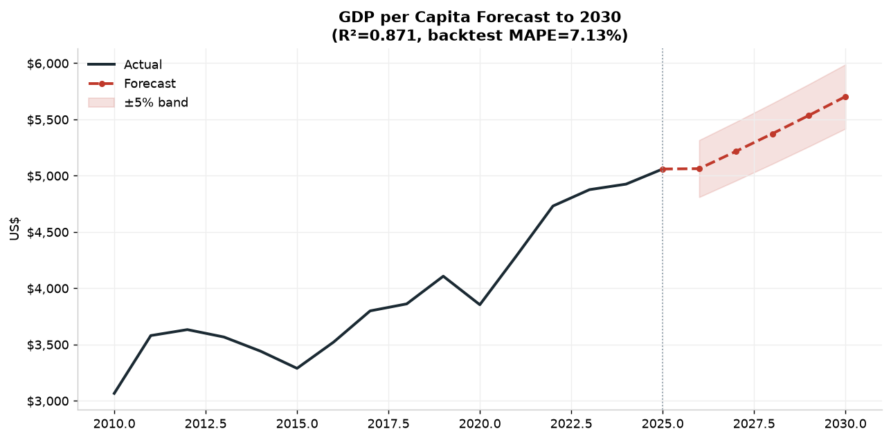
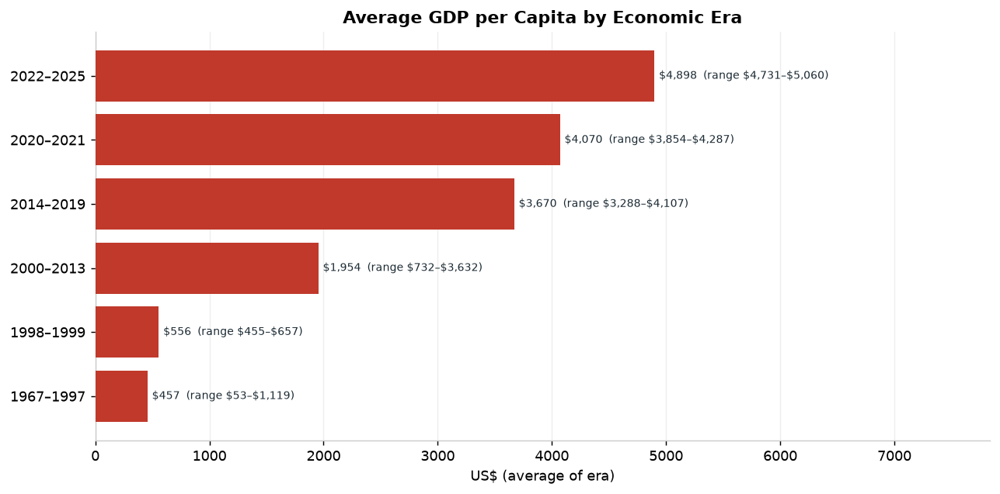

# 🇮🇩 Indonesia Economic Intelligence

**Analisis 60+ tahun data ekonomi Indonesia (17 indikator, 1960–2025) — dari World Bank Open Data menjadi insight & ramalan yang dapat ditindaklanjuti.**

[](https://python.org)
[](https://pandas.pydata.org)
[](app/dashboard.py)
[](https://plotly.com)
[](https://data.worldbank.org)
[]()
[]()

---

## 🎬 Demo

<div align="center">
  
  <br/>
  <sub><i>Interactive Streamlit dashboard — trends, comparison, forecast & crisis tabs · 17 indicators · 1960–2025</i></sub>
</div>

<br/>

```bash
streamlit run app/dashboard.py     # → http://localhost:8502
```

---

## 🧠 Overview

**Indonesia Economic Intelligence** adalah studi data analyst end-to-end atas
**60+ tahun ekonomi Indonesia**. Data ditarik dari **World Bank Open Data API**
(publik & gratis), dibersihkan, dianalisis lintas-era, dan **diramalkan** untuk
5 tahun ke depan.

<div align="center">

| Metric | Value |
|-------:|:------|
| 📊 Source | World Bank Open Data (API publik) |
| 📅 Coverage | **1960–2025** (66 tahun) |
| 🧩 Indicators | **17** (GDP, inflasi, populasi, sosial, lingkungan) |
| 📈 Records | 874 data points |
| 🔮 Forecast | 5 tahun (2026–2030) dengan backtest MAPE |
| 🖥️ Deliverables | Streamlit app · 8 charts · 14 insight tables · business report |

</div>

---

## 🔑 Temuan Utama

| # | Temuan | Angka |
|---|--------|-------|
| 1 | GDP per kapita naik **~95×** sejak 1967 | $53 → **$5.060** (2025) · CAGR **8,17%** |
| 2 | Inflasi hiperinflasi 1966 → stabil | **1.136%** (1966) → **1,9%** (2025) |
| 3 | Indonesia **berhenti jadi negara agraris** | urbanisasi **14,6% → 59,4%** |
| 4 | Transformasi digital tercepat | internet **0,9% → 72,8%** |
| 5 | Krisis 1998 jauh lebih dalam dari COVID | GDP **−13,1%** (1998) vs −2,1% (2020) |
| 6 | Harapan hidup naik 24 tahun | **46,8 → 71,3** tahun |

---

## 📊 Visualisasi Kunci

| GDP per kapita (1967–2025) | Pertumbuhan & krisis |
|:---:|:---:|
|  |  |

| Inflasi (log) | Populasi & urbanisasi |
|:---:|:---:|
|  |  |

| Indikator sosial | Korelasi antar-indikator |
|:---:|:---:|
|  |  |

| Forecast GDP per kapita | Perbandingan era |
|:---:|:---:|
|  |  |

---

## 🔮 Forecasting

Model peramalan disesuaikan per indikator (bukan satu model untuk semua):

| Indikator | Metode | R² | MAPE (backtest) | Prediksi 2030 |
|-----------|--------|----:|----------------:|---------------|
| GDP (US$) | log-trend | 0,93 | **6,4%** | ~$1,72 T |
| GDP per kapita | log-trend | 0,87 | **7,1%** | ~$5.703 |
| Populasi | log-trend | 0,99 | **3,0%** | ~313,6 jt |
| Urbanisasi | linear | 0,98 | **3,1%** | ~65,0% |
| Harapan hidup | linear | 0,93 | **2,2%** | ~72,9 thn |
| Internet | damped (S-curve) | 0,92 | 19,8% | ~78,9% |
| Inflasi | mean-reverting | 0,64 | ⚠️ 52,8% | ~2,9% |

> **Pelajaran modeling (jujur):** memakai SELURUH sejarah (1967–2025) untuk
> meramal GDP menghasilkan angka tak realistis (+117% / 5 tahun) karena
> memasukkan era pertumbuhan tinggi yang sudah berakhir. Diperbaiki dengan
> memakai **rezim terkini** (2010+) → hasil masuk akal (+19%). Inflasi tetap
> sulit diramal karena sifatnya volatil — dilaporkan apa adanya (MAPE tinggi).

---

## 🗂️ Struktur Proyek

```
indonesia-economy-intelligence/
├── app/
│   ├── dashboard.py                 # 📊 Interactive Streamlit dashboard
│   └── .streamlit/config.toml
├── src/
│   ├── collect_worldbank.py         # tarik 17 indikator dari World Bank API
│   ├── analysis.py                  # tren, era, korelasi, dampak krisis
│   ├── forecast.py                  # peramalan multi-metode + backtest
│   ├── run_analysis.py              # orkestrator (tabel + summary.json)
│   └── make_charts.py               # 8 visualisasi
├── data/
│   ├── raw/                         # data World Bank (long format)
│   └── processed/                   # wide format (year × indicator)
├── reports/
│   ├── figures/                     # 8 chart + 2 dashboard screenshot
│   ├── tables/                      # 14 tabel insight
│   └── summary.json                 # metrik & insight utama
└── requirements.txt
```

---

## 🚀 Cara Menjalankan

```bash
pip install -r requirements.txt

# 1. tarik data dari World Bank API
python src/collect_worldbank.py

# 2. analisis + tabel + summary
python src/run_analysis.py

# 3. charts
python src/make_charts.py

# 4. dashboard interaktif
streamlit run app/dashboard.py     # → http://localhost:8502
```

---

## 🛠️ Tech Stack

`Python` · `pandas` · `numpy` · `matplotlib` · `Plotly` · `Streamlit` · World Bank API

---

## ⚠️ Keterbatasan (Disclosure Jujur)

1. **Proyeksi World Bank:** beberapa tahun terakhir (2024–2025) dapat berisi
   estimasi/proyeksi World Bank, bukan angka final.
2. **Inflasi sulit diramal** — model linear/mean-reversion punya error besar.
3. **Korelasi ≠ kausalitas** — heatmap menunjukkan asosiasi statistik, bukan sebab-akibat.
4. **Cakupan indikator terbatas** pada 17 indikator makro terpilih.

---

## 📬 Kontak

**Sandi Ridwan** — Data Analyst · Data Automation Engineer · Python

[GitHub](https://github.com/SandiRidwan) · [LinkedIn](https://www.linkedin.com/in/sandi-ridwan/) · [Upwork](https://www.upwork.com/freelancers/~011f6d0fbb4a372974)

---

*Data: World Bank Open Data · Dibuat untuk portofolio data analyst.*
